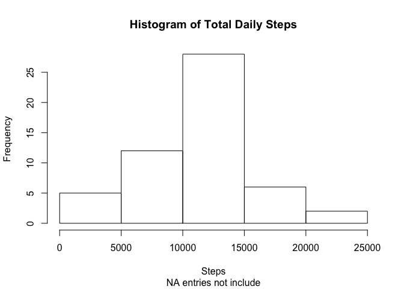
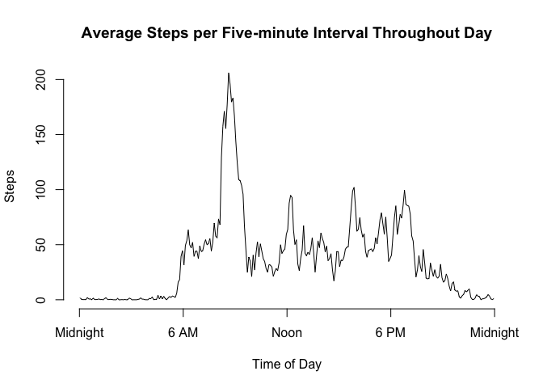
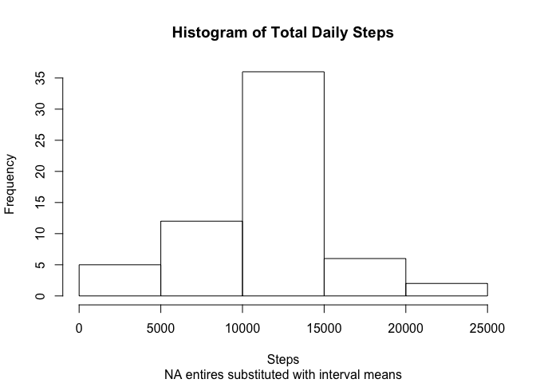
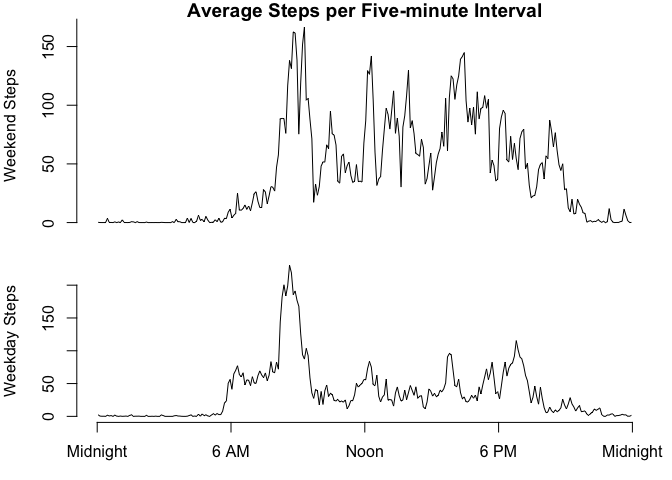
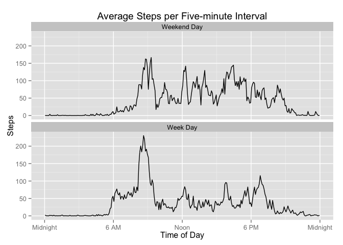

# Reproducible Research: Peer Assessment 1


## Loading and preprocessing the data


## What is mean total number of steps taken per day?


## What is the average daily activity pattern?


## Imputing missing values


## Are there differences in activity patterns between weekdays and weekends?


---
title: "Project 1 - Reproducible Research"
author: "RB"
date: "November 4, 2015"
output: html_document
---

#Introduction
This is the first assignment in the class Reproducible Research offered through Coursea in November 2015. The object of the exercise it to practice literate programming using markdown language, knitr, and R to produce an HTML output.  This is done by answering a series of questions of a data set obtained with a personal activity monitoring device. This data set contains the number of steps taken by an individual during 5 minute intervals over the months of October and November of 2012.  The data set is obtained from **https://d396qusza40orc.cloudfront.net/repdata%2Fdata%2Factivity.zip** and was downloaded on 11/4/2015.  Other information regarding the source is not available.


##Load data set and necessary library functions for analysis.

```r
filename = "activity.csv"
if (!file.exists(filename))
  unzip("activity.zip")

data = read.csv(filename)
library(reshape2)
library(chron)
```

##Part 1
**What is mean total number of steps taken per day?**

1. For this part of the assignment, you can ignore the missing values in the dataset.

2. Calculate the total number of steps taken per day

3. Make a histogram of the total number of steps taken each day

4. Calculate and report the mean and median of the total number of steps taken per day

The direction to "ignore missing values" is ambiguous.  Does it mean intervals without data are discarded or counted as zero?  Are the days containing missing data discarded or summed with nothing for the missing interval and therefore possibly less than the true total?  There are eight days containing missing data and all data is missing from those eight days.  Thus the daily totals will be complete for the remaining 53 days.  

**Code Part 1**

The code below generates a histogram of total daily steps and displays the mean and median of the total daily steps using the 53 complete days.


```r
mdata = melt(data, id=c("date", "interval"))  
totalDailySteps = dcast(mdata, date~variable, sum)

s1 = summary(totalDailySteps$steps)
outputStr = paste(as.character(s1[4]), as.character(s1[3]), sep = ' and ')

hist(totalDailySteps$steps, 
     main='Histogram of Total Daily Steps',
     sub='NA entries not include',
     xlab='Steps',
     ylab='Frequency')
```

 

Mean and Median of the distribution are 10770 and 10760 respectively.

##Part 2
**What is the average daily activity pattern?**

1. Make a time series plot (i.e. type = "l") of the 5-minute interval (x-axis) and the average number of steps taken, averaged across all days (y-axis)

2. Which 5-minute interval, on average across all the days in the dataset, contains the maximum number of steps?

**Code Part 2**

The code below recasts the melted data from Part 1 and then calculates the mean steps during each five minute interval, converts intervals to time of day, determines the interval with maximum steps, and graphs the average steps perinterval throughout the day


```r
meanIntervalSteps = dcast(mdata,interval~variable, mean, na.rm=T)

#convert time to linear hour scale at mid-point of intervals  
times = meanIntervalSteps$interval
meanIntervalSteps$timeOfDay = floor(times/100) + (times %% 100)/60 + 2.5/60

maxInterval = meanIntervalSteps$timeOfDay[which.max(meanIntervalSteps$steps)]

#Interval output string in 24-hour time.
maxIntervalStr = paste(floor(maxInterval-2.5/60), 
                       ":",
                       ((maxInterval-2.5/60) %% 1)*60,
                       ' to ',
                       floor(maxInterval+2.5/60), 
                       ":",
                       ((maxInterval+2.5/60) %% 1)*60,
                       sep='')

plot(meanIntervalSteps$timeOfDay, meanIntervalSteps$steps, 
     type = 'l',
     axes = F,
     main="Average Steps per Five-minute Interval Throughout Day",
     xlab="Time of Day",
     ylab='Steps'
     )
axis(1, at=c(0, 6, 12, 18, 24), labels=c("Midnight", "6 AM", "Noon", "6 PM", "Midnight"))
axis(2, at=c(0,50,100,150,200) )
```

 

Maximun average number of steps occurs in interval from 8:35 to 8:40 (24 hour time format.)

##Part 3
**Imputing missing values**

1. Calculate and report the total number of missing values in the dataset (i.e. the total number of rows with NAs)

2. Devise a strategy for filling in all of the missing values in the dataset. The strategy does not need to be sophisticated. For example, you could use the mean/median for that day, or the mean for that 5-minute interval, etc.

3. Create a new dataset that is equal to the original dataset but with the missing data filled in.

4. Make a histogram of the total number of steps taken each day and Calculate and report the mean and median total number of steps taken per day. Do these values differ from the estimates from the first part of the assignment? What is the impact of imputing missing data on the estimates of the total daily number of steps?

**Strategy to impute missing observations:**
Any missing values are replaced with the mean of values for that 5 minute interval observed in the complete parts of the data set.

**Code Part 3**
The code calculates the number of missing values, substitues interval means when it is missing, presents a histogram of total daily steps and summary to display the mean and median of the total daily steps using the 53 complete daysnand eight imputed days.   


```r
numNA = length(data$steps[is.na(data$steps)])

#Create data frame of missing value from melted data in Part 1.
mdataNA = mdata[is.na(mdata$value),]
#Identify the days with missing data
datesWithNA = unique(mdataNA$date)
#Number of missing days
numDatesWithNA = length(datesWithNA)
#Substitue the means calculated in Part 2 
mdataNA$value = rep(meanIntervalSteps$steps, numDatesWithNA)
#Create dataframe of complete day.
mdataNoNA = melt(data, id=c("date", "interval"), na.rm=T)  
#Combine the complete data with the imputed data
fullmdata = rbind(mdataNoNA, mdataNA)
totalDailyStepsAllDays = dcast(fullmdata, date~variable, sum)

s2 = summary(totalDailyStepsAllDays$steps)
outputStr1 = paste(as.character(s2[4]), as.character(s2[3]), sep=' and ')
outputStr2 = paste(as.character(s1[3]), as.character(s2[3]), sep=' to ')
hist(totalDailyStepsAllDays$steps, 
     main='Histogram of Total Daily Steps',
     sub='NA entires substituted with interval means',
     xlab='Steps',
     ylab='Frequency')
```

 

Mean and Median of the distribution are 10770 and 10770 respectively. Given that NA values were imputed from the means of the intervals there is no change from the mean calculated in Part 1.  The median is shifted towards the mean (from 10760 to 10770, in this case they now coincide.) The histogram is increased centrally by eight since the central bar contains the mean.

##Part 4
**Are there differences in activity patterns between weekdays and weekends?**

For this part the weekdays() function may be of some help here. Use the dataset with the filled-in missing values for this part.

1. Create a new factor variable in the dataset with two levels – “weekday” and “weekend” indicating whether a given date is a weekday or weekend day.

2. Make a panel plot containing a time series plot (i.e. type = "l") of the 5-minute interval (x-axis) and the average number of steps taken, averaged across all weekday days or weekend days (y-axis). See the README file in the GitHub repository to see an example of what this plot should look like using simulated data.


```r
fulldata = dcast(fullmdata, date + interval ~ variable)
weekend = is.weekend(as.Date(as.character(fulldata$date)))
dataWithWE = cbind(weekend,fulldata[,2:3])
mdata = melt(dataWithWE, id=c("weekend", "interval"))
mdataWE = mdata[mdata$weekend,]
stepsWE = dcast(mdataWE,interval~variable, mean)
mdataWD = mdata[!mdata$weekend,]
stepsWD = dcast(mdataWD,interval~variable, mean)

par(mfrow=c(2,1),mar =c(0.5,4,1,1))
plot(meanIntervalSteps$timeOfDay, stepsWE$steps, 
     type = 'l',
     axes = F,
     main="Average Steps per Five-minute Interval",
     xlab="",
     ylab='Weekend Steps'
     )
axis(2, at=c(0,50,100,150,200) )

par(mar=c(3,4,1,1))
plot(meanIntervalSteps$timeOfDay, stepsWD$steps, 
     type = 'l',
     axes = F,
     #main="Average Steps per Five-minute Interval, Weekdays",
     xlab="Time of Day",
     ylab='Weekday Steps'
     )
axis(1, at=c(0, 6, 12, 18, 24), labels=c("Midnight", "6 AM", "Noon", "6 PM", "Midnight"))
axis(2, at=c(0,50,100,150,200) )
```

 


```r
dataWithWE$we = factor(as.factor(dataWithWE$weekend), 
                       levels = c("TRUE","FALSE"), 
                       labels=c("Weekend Day", "Week Day"))
alldata =dataWithWE[,2:4]
md = melt( alldata, id=c("interval","we"))
dd = dcast(md, we+interval~variable, mean) 
dd$t = meanIntervalSteps$timeOfDay
library(ggplot2)
ggplot(data=dd, aes(x=t, y = steps)) +
  geom_line() +
  facet_wrap(~we, nrow = 2) +
  scale_x_continuous(breaks=c(0,6,12,18,24),
                labels=c("Midnight", "6 AM", "Noon", "6 PM", "Midnight")) +
  labs(title="Average Steps per Five-minute Interval",
         x="Time of Day", y="Steps")
```

 
